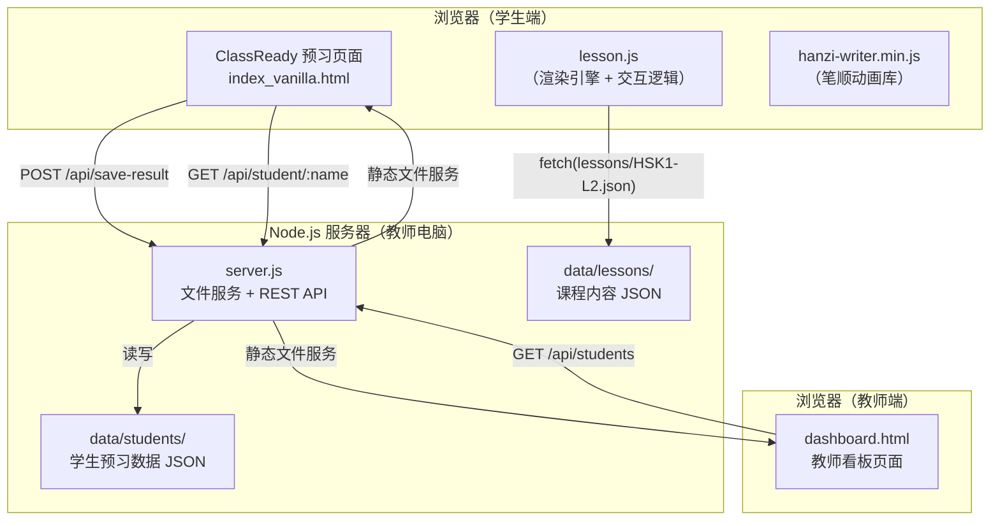
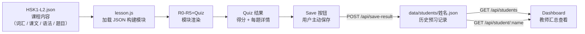
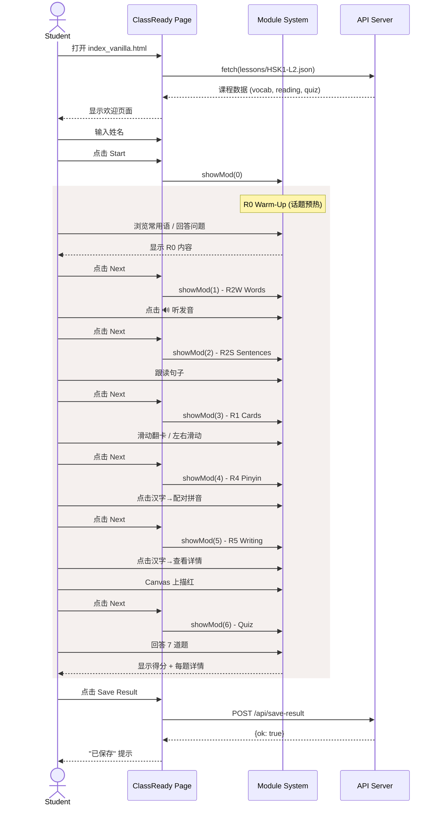
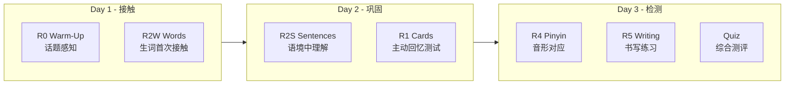
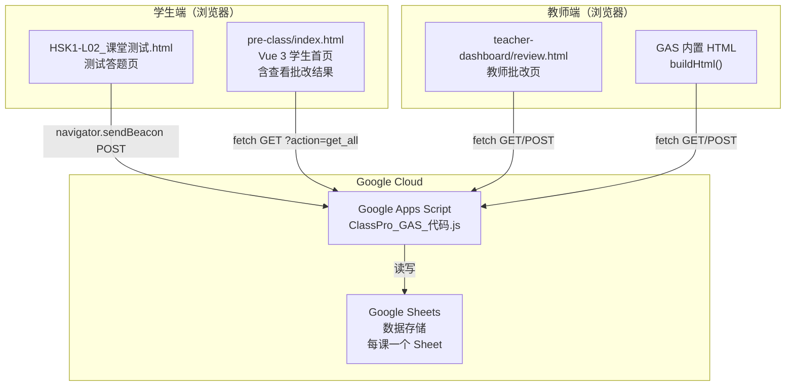

# ClassReady HSK1-L2 架构设计

基于当前已完成的功能（预习端），以 HSK1-L2 为例的完整架构说明。

---

## 一、整体架构



**当前架构的核心决策：**
- 一台教师电脑运行 Node.js 服务
- 学生在同一 WiFi 下通过浏览器访问
- 数据以 JSON 文件存在教师电脑硬盘
- 无第三方服务依赖（数据库、云服务、CDN 皆无）

## 二、数据流



**数据生命周期：**
1. 课程数据（静态）：JSON → 浏览器加载 → 渲染
2. 预习数据（动态）：学生操作 → Quiz 结果 → 手动保存 → 服务器持久化
3. 汇总数据（读取）：教师看板 → API 查询 → 聚合展示

## 三、学生交互流程



## 四、模块结构

| 索引 | 模块 | 交互方式 | 数据依赖 |
|---|---|---|---|
| 0 | R0 Warm-Up | 浏览 + 思考 | 硬编码常用语 |
| 1 | R2W Words | 点击 🔊 听发音 | D.vocabData |
| 2 | R2S Sentences | 点击 🔊 听句子 | D.readingData → sentences |
| 3 | R1 Cards | 滑动（左/右）+ 翻页按钮 | D.vocabData |
| 4 | R4 Pinyin | 点击配对 | D.vocabData |
| 5 | R5 Writing | 点击汉字 → Canvas 描红 | 动态提取字符 + 本地笔顺数据 |
| 6 | Quiz | 选择题 7 道 | D.quiz |

**导航方式：** Prev/Next 底部固定按钮。
**状态管理：** 全局变量 cur, ci, cf 等，无外部状态库。

## 五、数据模型

### 课程内容 JSON

```json
{
  "lesson": "Lesson 2",
  "lessonTitle": "第2课：我叫李文",
  "lessonEnglishTitle": "My name is Li Wen",
  "grammarPoints": ["...", "..."],
  "vocabData": [
    {"word": "不", "pinyin": "bù", "english": "not; no"},
    ...
  ],
  "readingData": [
    {
      "textId": 1,
      "context": "场景描述",
      "dialogue": [{"speaker": "...", "chinese": "...", "pinyin": "...", "english": "..."}]
    }
  ],
  "quiz": [
    {"q": "问题", "o": ["选项1","选项2","选项3","选项4"], "a": 0}
  ]
}
```

### 学生预习记录 JSON

```json
// data/students/张三.json
[
  {
    "lesson": "HSK1-L2",
    "date": "2026-07-06T02:40:54.326Z",
    "score": 5,
    "total": 7,
    "percentage": 71,
    "details": [
      {"q": "What does bu mean?", "correct": true},
      {"q": "How to say sorry?", "correct": false}
    ]
  }
]
```

## 六、API 接口

| 方法 | 路径 | 功能 | 请求体 | 响应 |
|---|---|---|---|---|
| GET | `/api/students` | 全班概况 | - | `[{name, attempts, lastScore, lastPct, ...}]` |
| GET | `/api/student/:name` | 学生详情 | - | `{name, records: [...]}` |
| POST | `/api/save-result` | 保存预习结果 | `{name, lesson, score, total, details}` | `{ok: true}` |

所有 API 通过 `server.js` 提供，运行在 port 18765。

## 七、微步骤预习（分 3 天）设计思路

将当前 7 个模块拆分为 3 天的渐进式预习：



**需要实现：**
- 每日任务状态追踪（存到 localStorage 或已保存的学生数据中）
- "解锁"机制：完成前一天任务后才开放后一天
- 教师端能看到学生预习到第几天

## 八、当前状态与下一步

| 部分 | 状态 | 备注 |
|---|---|---|
| ClassReady 预习流程 | ✅ 完成 | 7 个模块可完整走通 |
| 课程数据化 | ✅ 完成 | lesson.js 无硬编码，从 JSON 加载 |
| 预习结果存储 | ✅ 完成 | POST 接口 + data/students 存储 |
| 教师看板 | ✅ 完成 | dashboard.html 基础版 |
| 微步骤（3 天）| ❌ 待实现 | 需要状态追踪 + UI 调整 |
| R5 笔顺动画 | 🟡 待修复 | HanziWriter 集成有问题 |
| ClassPro 课中互动 | ❌ 未开始 | 下一个大阶段 |
| 课程选择页 | ❌ 未实现 | 目前直接加载 JSON |
| 多课支持 | ❌ 未实现 | 目前只有 L2 |

---

*文档生成日期：2026-07-06 | 基于 HSK1-L2 实际实现*
---

## 九、GAS 云端数据架构（2026-07-07 新增）

在原有本地 JSON 存储的基础上，引入了 **Google Apps Script + Google Sheets** 作为云端数据层，用于学生测试数据提交、教师批改、学生查看批改结果的全流程。

### 9.1 整体架构



**核心设计原则：**
- 数据统一存储在 Google Sheets，所有端（学生测试、学生查看、教师批改）均通过 GAS API 读写
- 学生端可直接通过 `file://` 或 GitHub Pages 打开，无需本地服务器
- 教师批改页可独立部署，也可通过 GAS 内置 HTML 页直接访问

### 9.2 数据模型（Google Sheets 列定义）

| 列索引 | 列名 | 含义 | 写入方 | 更新方 |
|---|---|---|---|---|
| A | 提交时间 | 自动记录提交时的时间戳 | GAS doPost | - |
| B | 姓名 | 学生姓名 | 学生测试页 | - |
| C | 课程 | 课程标识（如 HSK1-L02） | 学生测试页 | - |
| D | 环节 | 阶段（预习/课中/课后） | 学生测试页 | - |
| E | 模块 | 题型模块名（如选词填空） | 学生测试页 | - |
| F | 得分 | 客观题得分 / 教师打分 | 学生测试页 | 教师批改 |
| G | 总分 | 该题满分 | 学生测试页 | - |
| H | 薄弱点 | 关联的知识点标签 | 学生测试页 | - |
| I | 学生作答 | 学生的答案原文 | 学生测试页 | - |
| J | 教师批改 | 教师评语 / 纠错 | - | 教师批改 |
| K | 批改状态 | 待批改 / 已批改 / 无需批改 | GAS doPost | 教师批改 |

### 9.3 GAS API 接口

**部署 URL**（生产环境）：
```
https://script.google.com/macros/s/AKfycbxrCd6f6cQ3wocXYQZyLKY0JutolEmOWWzTGOABnnHHJOm697OfyBlkLw-SQ-u-9ZAO/exec
```

#### GET 方法

| Action | 参数 | 返回值 | 用途 |
|---|---|---|---|
| `get_all` | 无 | `{status, data: {课名: [记录...]}}` | 获取所有课程的所有提交 |
| `get_data` | `lesson=课程名` | `{status, count, data: [记录...]}` | 获取指定课程的数据 |
| `list_sheets` | 无 | `{status, sheets: [课名...]}` | 列出所有课程 Sheet |
| 无 | 无 | 返回内置批改 HTML | 直接访问 GAS URL 时显示 |

#### POST 方法（JSON body）

| Action | 字段 | 用途 |
|---|---|---|
| `save_score` | `lesson, timestamp, studentName, score, correction` | 教师批改打分 + 写评语 |
| `mark_reviewed` | `lesson, timestamp, studentName, correction` | 仅标记已批改（不改分数） |
| 无 | `studentName, lesson, stage, module, score, total, weakPoints, answer, openEnded` | 学生提交测试数据 |

**关键实现细节（`source/data-model/ClassPro_GAS_代码.js`）：**

```js
// doPost — 三种行为
if (d.action === 'save_score') return saveScore(ss, d);
if (d.action === 'mark_reviewed') return markReviewed(ss, d);
// 默认：追加新行
sheet.appendRow([new Date(), d.studentName||'', ln, ...]);

// saveScore — 按时间戳+姓名匹配行
function saveScore(ss, d) {
  var targetTs = new Date(d.timestamp).getTime();
  for (var i=1; i<rows.length; i++) {
    var rowTs = rows[i][0] instanceof Date ? rows[i][0].getTime() : new Date(rows[i][0]).getTime();
    // 兼容不同时间戳格式，用毫秒差 <2s 匹配
    if (Math.abs(rowTs - targetTs) < 2000 && rows[i][1] === d.studentName) {
      sheet.getRange(i+1, 6).setValue(d.score);    // 得分
      sheet.getRange(i+1, 10).setValue(d.correction); // 教师批改
      sheet.getRange(i+1, 11).setValue('已批改');    // 状态
    }
  }
}
```

### 9.4 学生测试流程

| 步骤 | 页面 | 操作 |
|---|---|---|
| 1 | `HSK1-L02_课堂测试.html` | 学生输入姓名，开始答题 |
| 2 | 同上 | 选择题：点选后即时通过 `navigator.sendBeacon` 提交 |
| 3 | 同上 | 开放题：写完后点击提交 |
| 4 | 同上 | 显示客观题得分 + "开放题已提交，等待老师批改" |

**提交数据示例：**
```js
// 选择题提交
navigator.sendBeacon(GAS_URL, new Blob([JSON.stringify({
  studentName: "张三", lesson: "HSK1-L02", stage: "预习",
  module: "选词填空", score: 1, total: 1, weakPoints: "词汇：是",
  answer: "是", openEnded: "no"
})], {type: "text/plain"}));

// 开放题提交
navigator.sendBeacon(GAS_URL, new Blob([JSON.stringify({
  studentName: "张三", lesson: "HSK1-L02", stage: "预习",
  module: "开放式造句", score: 0, total: 10, weakPoints: "综合：自我介绍",
  answer: "我叫张三。", openEnded: "yes"
})], {type: "text/plain"}));
```

### 9.5 教师批改流程

| 步骤 | 页面 | 操作 |
|---|---|---|
| 1 | `review.html` 或 GAS 内置页 | 打开后自动 fetch 所有待批改记录 |
| 2 | 同上 | 在表格中查看学生作答 |
| 3 | 同上 | 输入得分 + 批改评语 |
| 4 | 同上 | 点击"批改"按钮 |
| 5 | 同上 | fetch POST 到 GAS `save_score` |
| 6 | 同上 | 成功后 UI 更新为"已批改" |

**批改 API 调用（`review.html`）：**
```js
fetch(U, {method: 'POST', body: JSON.stringify({
  action: 'save_score',
  lesson: td[2].textContent,
  timestamp: td[0].textContent,  // ISO 格式时间戳
  studentName: td[1].textContent,
  score: sc,
  correction: fix
})}).then(r => r.json()).then(d => {
  if (d.status === 'ok') { /* 更新 UI */ }
  else { alert('保存失败，请重试！') }
}).catch(() => alert('网络错误，保存失败！'));
```

### 9.6 学生查看批改结果流程

| 步骤 | 页面 | 操作 |
|---|---|---|
| 1 | `pre-class/index.html` | 打开页面，点击"查看批改结果" |
| 2 | 同上 | 输入姓名，点击"查询" |
| 3 | 同上 | 前端 fetch GAS `?action=get_all` 获取全量数据 |
| 4 | 同上 | 按姓名过滤，显示该学生的所有提交记录 |
| 5 | 同上 | 每条记录展示：模块、得分、作答、教师批语、状态 |

**页面技术栈：**
- Vue 3（`vue.global.prod.js` 本地加载，无需 CDN）
- 数据直接通过 `fetch()` 请求 GAS 部署 URL
- 支持桌面和手机端（`max-width: 480px` 响应式布局）

**数据获取逻辑（`pre-class/index.html`）：**
```js
fetch(GAS_URL + '?action=get_all')
  .then(r => r.json())
  .then(d => {
    var all = [];
    if (d.status === 'ok') {
      var dd = d.data;
      if (Array.isArray(dd)) { all = dd; }
      else { for (var k in dd) { dd[k].forEach(x => all.push(x)); } }
    }
    reviews.value = all.filter(x => x.姓名 === n);
  });
```

### 9.7 已修复的问题

#### 问题 1：时间戳格式不匹配导致批改无法保存

**症状：** 教师点击批改后，UI 显示"已批改"，但 Google Sheets 数据未更新，学生端仍显示"待批改"。

**根因：** `saveScore` 中用 `Utilities.formatDate(rows[i][0], 'Asia/Shanghai', 'yyyy-MM-dd HH:mm')` 格式化 Sheet 中的时间，而浏览器发来的 `d.timestamp` 是 ISO 格式（如 `2026-07-07T03:30:00.000Z`），二者不相等，匹配失败。

**修复（`ClassPro_GAS_代码.js`）：**
```js
// 改前
var ts = Utilities.formatDate(rows[i][0], 'Asia/Shanghai', 'yyyy-MM-dd HH:mm');
if (ts === d.timestamp && rows[i][1] === d.studentName) { ... }

// 改后
var targetTs = new Date(d.timestamp).getTime();
var rowTs = rows[i][0] instanceof Date ? rows[i][0].getTime() : new Date(rows[i][0]).getTime();
if (Math.abs(rowTs - targetTs) < 2000 && rows[i][1] === d.studentName) { ... }
```

#### 问题 2：navigator.sendBeacon 无错误反馈

**根因：** `review.html` 使用 `navigator.sendBeacon` 发送批改数据，该方法是 fire-and-forget，不返回响应。无论保存成功与否，前端都立即乐观更新 UI，导致教师以为批改成功实则失败。

**修复（`review.html`）：** 改用 `fetch()`，根据 GAS 返回结果决定是否更新 UI，失败时弹 alert 提示。

#### 问题 3：Vue 3 模板中全局变量不可访问

**根因：** Vue 3 模板编译后不通过 `with()` 查找变量，`{{D.lessonTitle}}` 中的 `D` 需要在 setup 中显式返回。

**修复：** `return {D, p, mi, ...}` — 将 `D` 加入组件上下文。

### 9.8 部署说明

| 场景 | 方式 | URL 示例 |
|---|---|---|
| 本地开发测试 | `node server.js` | `http://localhost:18765/source/pre-class/index.html` |
| 学生手机访问 | GitHub Pages | `https://用户名.github.io/仓库名/source/pre-class/index.html` |
| 教师批改（本地） | `node server.js` | `http://localhost:18765/source/teacher-dashboard/review.html` |
| 教师批改（直接） | 访问 GAS URL 本身 | `https://script.google.com/macros/s/.../exec` |

**部署步骤（GitHub Pages）：**
1. 将整个项目推送到 GitHub 仓库
2. 仓库 Settings → Pages → 选择 main 分支发布
3. 学生通过上述 URL 访问，数据直接与 GAS 通信

### 9.9 文件索引

| 文件路径 | 用途 | 关键依赖 |
|---|---|---|
| `source/data-model/ClassPro_GAS_代码.js` | GAS 核心逻辑（存储 + 批改 API + 内置批改页） | Google Sheets, ContentService |
| `source/pre-class/HSK1-L02_课堂测试.html` | 学生测试答题页（选择题 + 开放题） | GAS URL |
| `source/pre-class/index.html` | 学生主页（含查看批改结果） | Vue 3, GAS URL |
| `vue.global.prod.js` | Vue 3 本地构建（免 CDN 加载） | - |
| `source/teacher-dashboard/review.html` | 教师批改页面（本地版） | GAS URL |
| `server.js` | Node.js 本地服务器（静态文件服务 + GAS 代理） | - |

---

*本节更新日期：2026-07-07 | 对应 GAS 云端数据架构 v1*

## 十、HSK1 前几课课前模板暂定规范（2026-07-18）

HSK1 前几课先统一采用六步课前预习模板，后续课程在此基础上扩展，不随意改变导航结构：

1. Step 1/6 话题预热 / Topic Warm-up
2. Step 2/6 词卡学习 / Word Cards
3. Step 3/6 跟读练习 / Read Aloud
4. Step 4/6 生词闯关 / Vocabulary Match
5. Step 5/6 汉字书写 / Character Writing
6. Step 6/6 预习小测 / Quick Check

页面规范：

- 每一步只在顶部显示一次 Step 标题，模块内部不重复显示同名标题。
- 中文使用楷体，英文使用 Times New Roman，拼音使用宋体。
- 拼音统一显示在对应汉字上方。
- 词卡支持左右滑动：左滑查看拼音和英文，右滑标记已掌握。
- 生词闯关使用 4×4 中文—英文连连看。
- 汉字书写使用可触屏 Canvas 练习。
- 小测共 10 题，选择后自动进入下一题；完成后统一显示分数、正确率和错题报告。
- 同一页面流程只提供一次小测机会，不提供重复测试入口。

当前页面备份：

source/pre-class/index.html.bak-20260718-step-title-template

主观题规则补充：

- HSK1-L02 保留原有两道课前主观题：自我介绍、使用“对不起/没关系”写简短对话。
- HSK1-L01 新增两道课前主观题：问候老师、和同学告别。
- 主观题统一以 openEnded=yes 写入 GAS 的课前记录，模块字段保留题目类型。
- 教师继续使用原有待批改工作台；教师反馈写回后，学生从课前页面的“查看批改结果”读取。
- L02 的客观题和主观题都属于样课验证范围，不能删除主观题。
