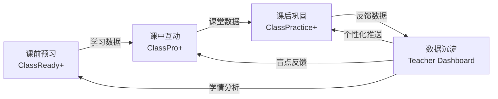

# Chinese ClassPro（HSK3.0） — 新HSK教学一体化生态系统

## 产品概述

Chinese ClassPro（HSK3.0） 是基于 ClassReady + ClassPro 五年迭代经验的全新升级。它不再是一个预习工具加一个课堂工具的简单拼盘，而是 **「课前—课中—课后」三位一体的教学闭环生态系统**。系统以数据为纽带，以 AI 为引擎，服务于教师的因材施教和学生的个性化成长。

---

## 设计起点：学生数据驱动

本产品蓝图的架构设计建立在真实的学生反馈之上：

- **数据来源**：本学期对使用 ClassReady / ClassPro 的学生进行访谈，收集了学生对平台功能的直接构想与改进建议
- **关键发现**：学生最迫切的需求集中在——写作与汉字书写练习、发音/声调纠正、AI 对话口语陪练、更多趣味游戏化机制、离线可用
- **设计转化的核心决策**：从"功能导向"转向"数据导向"——不是把学生想要的功能一个个堆上去，而是让数据在三阶段闭环中自然流动，驱动教学决策

> 这些需求直接映射到三阶段闭环的数据模型中：课前暴露盲点（基线数据）、课中差异化互动（课堂数据）、课后 AI 赋能巩固（巩固数据）。每一层的设计都回应了学生的真实声音。

---

## 一、核心理念：一个连续的闭环



**三个环节，一套数据，一个完整的学习周期。**

---

## 二、三阶段详细描述

### 阶段一：课前预习（试错阶段）

**目标：让学生暴露盲点，让老师看见学情**

* 学生收到本课的预习资料（生词卡片、课文音频、语法预览）
* 学生完成「试错式」预习任务 — 不是简单的浏览，而是**主动输出**
  * 生词跟读 + 读音评分
  * 课前小测（不设满分压力，真实记录第一次尝试的数据）
  * 语法尝试造句（开放题，自由探索）
* 学习数据实时上传到云端存储
* **教师端可在线查看每位学生的预习情况**
  * 谁预习了？谁没做？
  * 全班共性错题分布
  * 每个学生的个性化薄弱点
* **系统自动推送「预习反馈」给每位学生**
  * "你这次的弱点是 XX，建议课前再花 3 分钟复习一下"

> 数据价值：这是「基线数据」— 学生未经课堂学习时的真实状态。

### 阶段二：课中互动（讲授+练习）

**目标：高效互动，精准教学**

* 教师使用 ClassPro+ 进行课堂讲授和练习
* 互动形式沿用成熟的 MQTT（HiveMQ）架构实现实时数据中转
  * 扫码答题
  * 连词成句 / 选词填空 / 完成句子
  * PK 赛 / 随机点名
  * 弹幕墙 / 实时词云
* **差异化机制**（新）：系统根据课前预习数据，在课堂练习中对不同学生推送不同难度的题目
  * 预习正确率高的学生 → 挑战题
  * 预习正确率低的学生 → 基础巩固题
* 课堂数据实时呈现在教师大屏上
  * 全班正确率分布
  * 哪些知识点需要重点再讲
  * 谁需要额外关注

> 数据价值：这是「课堂数据」— 教师实时调整教学策略的依据。

### 阶段三：课后巩固（拓展+应用）

**目标：查漏补缺，学以致用**

* 系统根据课前 + 课中数据的综合分析，为每位学生生成**个性化的课后作业包**
  * 薄弱词汇的专项练习
  * 错题的变式训练
  * 语法点的针对性强化
* **口语练习**：AI 对话伙伴 — 学生可以与 AI 进行基于本课话题的开放式对话
  * 系统记录发音、语法错误
  * 提供逐句反馈
* **写作练习**：基于本课话题的短文写作
  * 支持汉字书写（拼音输入后生成）
  * AI 批改 + 教师复核
* **AI 学习助手**：学生遇到不会的问题可以随时向 AI 提问
  * 提供语音 + 文字交互方式
  * 记录学生的高频问题，同步给教师

> 数据价值：这是「巩固数据」— 检验教学效果、沉淀研究素材。

---

## 三、数据架构：一切以数据为中心

### 3.1 数据流

```
预习数据 ──┐
课堂数据 ──┼──→ 每课学习档案 ──→ 学生学习轨迹
课后数据 ──┘                       ↓
                          教师端仪表盘 + 教研分析
```

### 3.2 每课学习档案（Lesson Learning Record）

一课一档案，包含：

| 数据维度 | 内容 | 用途 |
|---|---|---|
| 预习数据 | 小测得分、错题分布、跟读评分 | 基线学情 |
| 课堂数据 | 互动次数、正确率、PK 排名、弹幕 | 过程评价 |
| 课后数据 | 写作评分、口语评分、AI 交互记录 | 巩固反馈 |
| 时间维度 | 各环节耗时、学习时长 | 学习习惯 |
| 薄弱点聚合 | 系统自动归纳的 weak points 标签 | 个性化推送 |

### 3.3 数据存储方案

* **原则**：从轻量起步，随需求演进。不在一开始建庞大的基础设施。
* **初始方案**：Google Sheets API（现有能力扩展）+ Google Drive（文件存储）
* **演进方案**：Airtable / Supabase + 云存储

---

## 四、用户角色

### 学生端

一个统一的学生门户，可查看：

* 当前课的学习进度（预习 √ / 课堂 √ / 课后 √）
* 历史学习档案（我的进步轨迹）
* 个性化推荐（系统根据薄弱点推送的练习）
* AI 学习助手入口

### 教师端

教师仪表盘，可查看：

* **班级总览**：全班的预习完成率、课堂活跃度、课后作业完成率
* **一课一看**：每一课的三阶段数据详情
* **学生画像**：每位学生的薄弱点、进步曲线、参与度
* **教学建议**：系统根据数据推荐的下一课教学重点调整
* **数据导出**：一键导出学习数据用于教研和课题申报

### 管理员 / 教研员（未来待定）

* 跨班级、跨年级的数据对比
* 教学效果分析
* 课程质量评价

---

## 五、多班复用策略

### 标准化

* **统一数据规范**：所有课程遵循相同的数据模型
* **标准备课流程**：教师只需要"提供教材原文 + 确认学生名单"，系统自动生成一课的全部内容
* **统一学生入口**：不同的班共用学生门户，通过"班级码"或"课程码"区分

### 个性化

* **班级级自定义**：每个班可以调整某些练习的题量、难度配比
* **学生级自适应**：AI 根据个人数据推送不同内容
* **教师风格保留**：系统不限制教师的讲课方式，只提供辅助数据

---

## 六、技术路线（初步）

### 前端

* 使用 Vue 3（与已有代码一致）构建 SPA
* 学生端、教师端、课后练习三个独立应用
* 移动端优先（学生使用手机）

### 实时通信

* MQTT via HiveMQ（已有成熟方案）
* 用于课堂互动数据的实时中转

### AI 能力

* 调用 LLM API（Claude / Gemini）进行：
  * 自动批改作文
  * 口语对话 + 纠音
  * 个性化薄弱点分析
  * 智能出题

### 数据层

* 初始阶段：Google Sheets API（现有 + 扩展）
* 演进阶段：引入轻量数据库

---

## 七、命名

系统定名为 **Chinese ClassPro（HSK3.0）**，承接 ClassPro 品牌，聚焦 HSK3.0 教学体系。

如果你有自己的想法，随时换名。

---

## 八、交付路线图

| 阶段 | 内容 | 产出 |
|---|---|---|
| P0 数据底座 | 升级统一数据规范 v2，覆盖三阶段所有数据 | data-model/spec-v2.md |
| P1 课前预习 | 升级 ClassReady+，增加跟读评分、自动反馈推送 | pre-class/ |
| P2 课中互动 | 升级 ClassPro+，增加差异化推送机制 | in-class/ |
| P3 教师仪表盘 | 数据可视化、学生画像、一键导出 | teacher-dashboard/ |
| P4 课后巩固 | AI 对话伙伴、写作批改、智能体学习助手 | post-class/ |
| P5 多班复用 | 班级管理、课程码、数据隔离 | 跨模块 |
| P6 自动化引擎 | 一条命令生成一课全部内容 | scripts/ |

> 这不是死顺序。我们可以按需调优先级。

---

## 九、产品原则（我们的宪法）

1. **数据不丢失**：所有学生产生的学习数据都被完整记录
2. **教师为舵**：AI 辅助决策，但教师掌握最终控制权
3. **学生可见**：每个学生都能看到自己的进步轨迹
4. **最小成瘾**：不为炫技加功能，每个功能都有教学目的
5. **渐进建设**：从轻量方案做起，用起来再升级

---

*文档版本：v0.3 | 更新日期：2026-07-06 | 系统定名：Chinese ClassPro（HSK3.0） | 新增设计起点说明*
